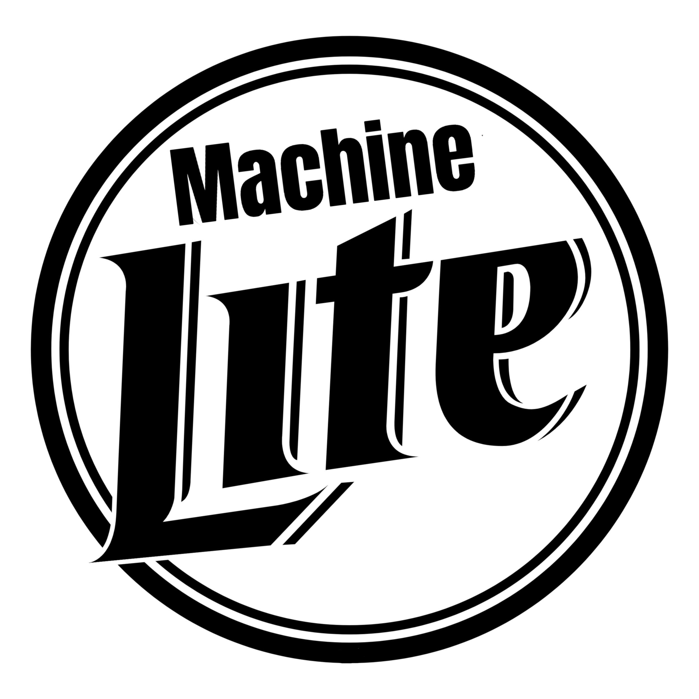

```{r setup, include=FALSE}
# Setting our Echo on output for the presentation to be false
knitr::opts_chunk$set(echo = FALSE)

```


```{r libraries, include=FALSE}
# Adding presentation style
knitr::opts_chunk$set(
	fig.align = "center",
	out.width = "80%",
	echo = FALSE,
	error=FALSE, 
	message=FALSE, 
	warning=FALSE);
# Libraries needed for analysis
library(dplyr)
library(ggplot2)
library(readr)
library(stringr)
library(highcharter)
library(ggthemes)
library(knitr)
library(dataMaid);
library(kableExtra);
```

```{r sessionInfo, include=FALSE}
# Ensuring we include all relevant package versions
sessionInfo()
```


# Introduction

## Team  
### Samantha Sprague  

### David Josephs  

### Carson Drake

## QOTD: Given the datasets Beer and Brews, we want to know:
###-Where our headquaters should be? 
###-What style of beer would appeal to the widest audience?
###-If we wanted to have a high ABV, what is the ideal IBU? 

```{r MLogo, echo=FALSE, out.width = '25%', fig.align='right'}

```

## The Data
```{r merge_data}
# Reading in CSV data sets
rawBeer <- read.csv(file = "data/raw/Beers.csv",header=TRUE, sep=",",stringsAsFactors=FALSE)
rawBrew <- read.csv(file= "data/raw/Breweries.csv", header=TRUE, sep=",", stringsAsFactors=FALSE)


# Next we rename  the brewery IDs, and merge the data
Beer1 <- rawBeer %>% rename(Brewery_ID=Brewery_id)
Brew1 <- rawBrew %>% rename(Brewery_ID=Brew_ID)
Beer1 <- Beer1 %>% select(Name,Beer_ID,ABV,IBU,Style,Ounces,Brewery_ID)
BeerBrew <- merge(Beer1,Brew1, by='Brewery_ID')

# Reordering the columns and give ourselves human readable names
BeerBrew <- BeerBrew %>% 
	rename(BeerName = Name.x) %>% 
	rename(BreweryName = Name.y)
BeerBrew <- BeerBrew %>% 
	select(BeerName,Beer_ID,ABV,IBU,Style,Ounces,BreweryName,Brewery_ID,City,State)

# Here we do a head of the new dataset BeerBrew
kable(head(BeerBrew,6))%>%
  kable_styling(full_width = F)
```

####<font size="1">
Caption: Here is a quick glance at the head of our merged dataset. You can see
we created easy to read captions and merged the two raw datasets with our
renames field "Brewery_ID".
</font>

####<font size="5">Here are the first 6 rows of our merged data set.</font>

## The Data (continued)
```{r summary_tail}
#This procudes a readable table for the presentation that includes the first six lines of the dataframe BeerBrew
kable(tail(BeerBrew,6))%>%
  kable_styling(full_width = F)
```

####<font size="1">
Caption: Here is a quick glance at the tail of our merged dataset. You can see we created easy to read captions and merged the two raw datasets with our renames field "Brewery_ID".
</font>

####<font size="5">Here are the last 6 rows of our merged data set.</font>


## The Data: Median Values and Breweries by State
```{r summary_state}
#Creating a dataset with the median ABVs and IBUs per state, and counting the number of breweries
StateSummary <- as.data.frame(BeerBrew 
							  %>% group_by(State) 
							  %>% summarise(medianABV = median(ABV, na.rm=TRUE),
							  			  medianIBU = median(IBU, na.rm=TRUE),
							  			  NumBreweries = n_distinct(Brewery_ID)))

#Creating a knitr table for the presentation
kable(head(StateSummary,6))%>%
  kable_styling(full_width = F)
```

#### <font size="5">
In order to make the dataset more friendly for analysis, we created a new
dataset from our merged dataset that would look at the median ABVs and IBUs,
along with the number of breweries for each state.
</font>


## Missing Values
#### The next logical step in analyzing the dataset was to find missing values. 
```{r NA_count, comment=""}
# This code is used to identify missing values and create the na_count dataframe
na_count <- data.frame(sapply(BeerBrew, function(y) sum(length(which(is.na(y))))))
na_count<- na_count%>%
	rename(na_count=sapply.BeerBrew..function.y..sum.length.which.is.na.y.....)
na_count 
```
########<font size="4">There are 62 missing data points for ABV, and 1005
missing data points for IBU.</font>

# Graphics: Number of Breweries


## 
```{r map_of_numbrew}
#Pulling in map data from the highcharter in order to render the US map
mapdata <- get_data_from_map(download_map_data("countries/us/us-all"))

#Adding a column called "hc-2a" in order to provide a primary key on both the
#mapdata df and our StateSummary df, "hc-2a" is equal to our State varaible
StateSummary$State <- str_trim(StateSummary$State,side="both")
StateSummary <- StateSummary %>% mutate(`hc-a2`= State);


#Below is an interactive state map that allows you to toggle over each state and
#showcase the number of breweries within that particular state. It also includes
#a heatmap to represent the number by color. The darker the state, the more
#breweries it contains! It reads in the data set from the api url and then
#merges it with our dataframe StateSummary on the varaible hc-2a.
hcmap("countries/us/us-all", data = StateSummary, value = "NumBreweries",
	  joinBy = "hc-a2", name = "State Summary | # of Breweries",
	  dataLabels = list(enabled = TRUE, format = '{point.name}'),
	  borderColor = "#FAFAFA", borderWidth = 0.1,
	  tooltip = list(valueDecimals = 1,valueSuffix = " # of Breweries")) %>%
	hc_colorAxis(minColor = "#FFFFFF", maxColor = "#7F152E") %>%
	hc_mapNavigation(enabled = TRUE) %>%
	hc_title(text = "<b>Number of Breweries by State</b>",
			 margin = 20, align = "center", 
			 style = list(color = "#000000", 
			 			 useHTML = TRUE))
```

####<font size="2">
We can see that the Colorado has the darkest coloring on the
graph which alludes to the highest number of breweries! Colorado contains 47
breweries. California, Oregon, Texas and Washington fall behind with 39, 29, 28,
and 23 breweries.
</font>


# Graphics: Analysis on ABV

## 
```{r map_abv}
# This is a map of the US colored by the median ABV by State, we used the same
# merging primary key and API call as the graphic above
map3 <-hcmap("countries/us/us-all", data = StateSummary, value = "medianABV",
	  joinBy = "hc-a2", name = "State Summary | Median ABV",
	  dataLabels = list(enabled = TRUE, format = '{point.name}'),
	  borderColor = "#FAFAFA", borderWidth = 0.1,
	  tooltip = list(valueDecimals = 5,valueSuffix = " ABV")) %>%
	hc_colorAxis(minColor = "#FFFFFF", maxColor = "#34675C") %>%
	hc_mapNavigation(enabled = TRUE) %>%
	hc_title(text = "<b>Median ABV by State</b>",
			 margin = 20, align = "center", 
			 style = list(color = "#000000", 
			 			 useHTML = TRUE))
htmltools::tagList(map3)
```

## Median ABV 

```{r abv_median,medianABVplot}
# This is another visual graph of the median ABV by state using ggplot, this
# allows us to see numerically the differences in median ABV by state
g <-ggplot(StateSummary, aes(x=reorder(State,-medianABV),y=medianABV, fill=medianABV)) +  
	geom_bar(stat="identity") 
 g2 <-g
 g3<-g2+coord_flip(ylim=c(.04,.0650))
 g4<-g3+theme(legend.position='none')
 g5<-g4+
 	scale_fill_gradient2(midpoint=median(StateSummary$medianABV),low='red', mid='snow3', high='black', space='Lab')+
 	theme_classic()+labs(x="State", y="ABV", legend="ABV")+
 	ggtitle("Median ABV by state") + 
 	theme(plot.title = element_text(hjust = 0.5),axis.text=element_text(size=5)) 
g5
```

## ABV Distribution
```{r abv_dist,fig.show='hold'}


# Plot Density Distribution of ABV
ggplot(Beer1, aes(x=ABV)) + 
 geom_histogram(aes(y=..density..),colour="black", fill="white", 
                position="identity")+
 	geom_density(alpha=.2)+
	geom_vline(aes(xintercept=mean(Beer1$ABV, na.rm = T)), color="blue",
             linetype="dashed")+
	labs(title="ABV Density Plot",x="ABV", y = "Density")+
	geom_text(data=Beer1, mapping=aes(x=mean(Beer1$ABV, na.rm = T), y=40, label=round(mean(Beer1$ABV, na.rm = T),digits=5)), size=4, angle=0, vjust=-0.4, hjust=0)
	
```


## Maximum ABV

```{r abv_max}
# This finds the state which has the most alcoholic beer, the name of the beer,
# the city it is produced in, and the actual ABV of the beer
MaxABV <- BeerBrew %>% 
	select(State, BeerName, City, ABV) %>% 
	filter(!is.na(ABV)) %>% 
	arrange(desc(ABV)) %>% 
	slice(1)
kable(MaxABV)%>%
  kable_styling(full_width = T)
```
<br>
<br>

####<font size="3">
Colorado has the most alcoholic beer of any state! Lee Hill Series Vol. 5, a
Belgian Style Quadrupel Ale produced in Boulder,CO has an ABV of 12.8%. We also
see that Kentucky and Washington DC prefer the most alcoholic beers overall,
while in general, the states prefer beer with an average alcoholic content,
giving the distribution a tight, somewhat normal shape.
</font>


# Graphics: Analysis on IBU

## 
```{r ibu_map}
# This is a map of the US colored by median IBU of beers brewed in each state,
# it uses the highcharter API and the same merging primary key as the above
# graphs
map2<-hcmap("countries/us/us-all", data = StateSummary, value = "medianIBU",
	  joinBy = "hc-a2", name = "State Summary | Median IBU",
	  dataLabels = list(enabled = TRUE, format = '{point.name}'),
	  borderColor = "#FAFAFA", borderWidth = 0.1,
	  tooltip = list(valueDecimals = 5,valueSuffix = " IBU")) %>%
	hc_colorAxis(minColor = "#FFFFFF", maxColor = "#4C3F54") %>%
	hc_mapNavigation(enabled = TRUE) %>%
	hc_title(text = "<b>Median IBU by State</b>",
			 margin = 20, align = "center", 
			 style = list(color = "#000000", 
			 			 useHTML = TRUE))
htmltools::tagList(map2)
```

## Median IBU

```{r ibu_median}
# This is another view that looks at median IBU of each beer brewed by state,
# note here that SD doesn't have any data for IBU of their beers
p<-ggplot(StateSummary, aes(x=reorder(State,-medianIBU),y=medianIBU, fill=medianIBU)) +  
	geom_bar(stat="identity") 
 p2 <-p
 p3<-p2+coord_flip(ylim=c(18,70))
 p4<-p3+theme(legend.position='none')
 p5<-p4+scale_fill_gradient2(midpoint=median(StateSummary$medianIBU,na.rm=TRUE),
 							low='red', mid='snow3', high='black', space='Lab')+
 	theme_classic()+labs(x="State", y="IBU", legend="IBU")+ggtitle("Median IBU by State") +
  theme(plot.title = element_text(hjust = 0.5),axis.text=element_text(size=5)) 
p5
```
 
## IBU Distribution
```{r ibu_dist,fig.show='hold'}
# Plot Density Distribution of IBU
ggplot(Beer1, aes(x=IBU)) + 
 geom_histogram(aes(y=..density..),colour="black", fill="white", 
                position="identity")+
 	geom_density(alpha=.2)+
	geom_vline(aes(xintercept=mean(Beer1$IBU,na.rm = TRUE)), color="blue",
             linetype="dashed")+
	labs(title="IBU Density Plot",x="IBU", y = "Density")+
	geom_text(data=Beer1, mapping=aes(x=round(mean(Beer1$IBU, na.rm = T),digits=2), y=0.022, label=round(mean(Beer1$IBU, na.rm = T),digits=4)), size=4, angle=0, vjust=-0.4, hjust=0)

```


## Maximum IBU 

```{r maximumIndividualIBU}
#This finds the state which has the most bitter beer, the name of the beer, the
#city it is produced in, and the actual IBU of the beer
MaxIBU <- BeerBrew %>% 
	select(State, BeerName,City,  IBU) %>% 
	filter(!is.na(IBU)) %>% 
	arrange(desc(IBU)) %>% 
	slice(1)
kable(MaxIBU)%>%
  kable_styling(bootstrap_options = "striped",full_width = T)
```
<br>
<br>

####<font size="3">
Oregon has the bitterest beer of any state! Bitter Bitch Imperial IPA, produced
in Astoria, has an IBU of 138! We also see that overall, Maine has the bitterest
beers. It seems that most states prefer beer which is less bitter than average,
giving the distribution of bitterness a right skew.
</font>


# Graphics: Analysis on ABV vs IBU

## ABV v IBU
```{r scatterplotgg}
# This graph draws a best fit linear line to the ABV v IBU comparsion plot. This
# line best represents a linear statistical model that would estimate the best
# IBU for a beer based on a given ABV, and vise versa.
q<-ggplot(data=BeerBrew, aes(x=ABV,y=IBU))+
	geom_point()+
	geom_smooth(method="glm",aes(color="Linear"))+
	scale_color_manual(name="Fits",breaks=c("Linear"),values=c("blue"))+
	theme_classic()+
	ggtitle("ABV v IBU") +
	theme(plot.title = element_text(hjust = 0.5))+
	labs(x="ABV", y="IBU")+xlim(.027,0.15)
q
```


## Another view: ABV vs IBU

```{r}

#This is an interactive scatterplot that shows the ABV v IBU for each beer and
#is colored by Style. You can see here that there are clusters that merge from
#ABV v IBU content, and that specific types of beer fall into these categories.
#Two prominent styles are black dots presented to be "American Double / Imperial
#IPA", and the pink dots represented to be "American IPAs". What other
#pattern/clusters do you see?
hchart(BeerBrew, "scatter", hcaes(x='BeerBrew$ABV',  y='BeerBrew$IBU', group ='BeerBrew$Style')) %>%
	hc_xAxis(title = list(text = "ABV for All Beers")) %>%
	hc_yAxis(title = list(text = "IBU for All Beers")) %>%
	hc_legend(enabled = FALSE) 
```


## Another view: Style Analysis
```{r}
# This is a treemap that graphs squares respective to size and color to help
# illustrate the frequency of Style within the dataset. You can see here that
# the market is saturated with American IPA's. Very popular beer!
BeerBrew %>% count(Style) %>% arrange(desc(n))%>% as.data.frame() -> styledf

hchart(styledf, "treemap", hcaes(x = 'styledf$Style', value = 'n', color = 'n'))

```


# Numbers: Summary Statistics

## Summary Statistics for ABV
```{r abv_summary, comment=""}
# This is the command to provide a summary statistic for the ABV variable
summary(BeerBrew$ABV, na.rm=TRUE)
```
####<font size="3">
You can see that the median ABV for all beers is roughly 0.056 and the mean ABV
is 0.5977. It is also worth noting that there at 62 beers who do not have a
recorded ABV. Those beers were not considered in the analysis for ABV.
</font>


## Summary Statistics for IBU
```{r ibu_summary, comment=""}
# This is the command to provide a summary statistic for the IBU variable
summary(BeerBrew$IBU, na.rm=TRUE)
```

####<font size="3">
You can see that the median IBU for all beers is roughly 35
and the mean IBU is 42.71. It is also worth noting that there at 1005 beers who
do not have a recorded IBU. Those beers were not considered in the analysis for
IBU.
</font>

# Conclusions

## Headquarter and Style of Beer Recommendation for Machine Lite
####<font size="3">
**We recommend**:  
Target Market: Arkansas, Mississippi, and Alabama  
State Headquarter: Mississippi
</font>

####<font size="3">
According to our linear model, for an above average ABV beer
at 0.06 (mean= 0.05977), the ideal IBU is roughly 35-40. 
</font>

####<font size="3">
According to our density plots and style treemap, the style of beer which
would appeal the wides audiance is the American IPA.
</font>


# Thank you

## Questions?

```{r pressure, echo=FALSE, out.width = '50%'}

```

# Index of Resources

## Codebook and HighCharter

####Please see github for any references relating to our codebooks for each data frame referenced in this analysis

####Please visit: http://jkunst.com/highcharter/ 


```{r codebook, include=FALSE}
# Original raw beer data
#makeDataReport(rawBeer)
# Original raw brew data
#makeDataReport(rawBrew)
# Merged beer and brew data set on brewery_id
#makeDataReport(BeerBrew)
# Median calculations for ABV and IBU for each state
#makeDataReport(StateSummary)
# Map data retrieved from high charter API
#makeDataReport(mapdata)
# NA analysis data frame
#makeDataReport(na_count)
# Max ABV data frame
#makeDataReport(MaxABV)
# Max IBU data frame
#makeDataReport(MaxIBU)
```

